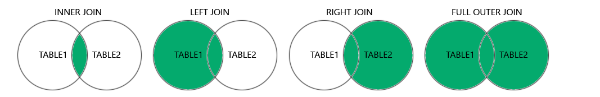

# Oracle 1Z0-071 Cheat Sheet (Sections 6–12)

## 6. Reporting Aggregated Data Using Group Functions
 - Following group functions can operate on a whole table or grouping of rows and produces one result
 - Group functions ignore null values
```sql
COUNT(*)      - Total number of rows
COUNT(col)    - Non-null values only
SUM(col)      - Total of numeric values
AVG(col)      - Average of values
MIN(col)      - Minimum value
MAX(col)      - Maximum value
VARIANCE()
STDDEV()

GROUP BY Example:
SELECT department_id, COUNT(*)
FROM employees
GROUP BY department_id;

SELECT MAX(salary), MIN(salary), MIN(employee_id)
FROM employees
WHERE department_id = 60;

HAVING Clause:
SELECT department_id, COUNT(*)
FROM employees
GROUP BY department_id
HAVING COUNT(*) > 5;
```
 -  The keyword DISTINCT is used to return only non-duplicate values or combinations of non-duplicate values in a query
 -  The keyword DISTINCT can be used with all group functions
 - NVL can also be used to replace null values
```sql
NVL(column_name, 0)
SELECT DISTINCT job_id
FROM employees;

SELECT AVG(NVL(commission_pct, 0))
FROM employees;
```

## 7. Displaying Data from Multiple Tables Using Joins
 - CROSS JOINS return the two tables multiplied
```sql
INNER JOIN:
SELECT e.first_name, d.department_name
FROM employees e
JOIN departments d ON (e.department_id = d.department_id);
```
 - Inner joins returns only matching rows
```SQL
OUTER JOIN:
SELECT e.first_name, d.department_name
FROM employees e
LEFT JOIN departments d ON (e.department_id = d.department_id);
```
 - Outer joins all rows(matching and unmatched)

```SQL
USING Clause:
SELECT e.first_name, d.department_name
FROM employees e
JOIN departments d USING (department_id);

SELF JOIN:
SELECT worker.last_name, worker.manager_id, manager.last_name
AS "Manager name"
FROM employees worker JOIN employees manager
ON (worker.manager_id = manager.employee_id);

THREE TABLES:
SELECT last_name, department_name AS "Department", city
FROM employees JOIN departments USING (department_id)
JOIN locations USING (location_id);
```
 - OUTER JOIN and FULL OUTER JOIN is the same thing


## 7.5 Hierarchical Queries (6-4)
 -  Hierarchical queries have their own new keywords: START WITH, CONNECT BY PRIOR, and LEVEL
 - START WITH identifies which row to use as the Root for the tree it i constructing, CONNECT BY PRIOR explains how to do the inter-row joins, and LEVEL specifies how
many branches deep the tree will traverse
```sql
SELECT employee_id, last_name, job_id, manager_id
FROM employees
START WITH employee_id = 100
CONNECT BY PRIOR employee_id = manager_id
```
 - LEVEL is a pseudo-column used with hierarchical queries, and it counts the number of steps it has taken from the root of the tree
```sql
SELECT LEVEL, last_name ||
' reports to ' ||
PRIOR last_name
AS "Walk Top Down"
FROM employees
START WITH last_name = 'King'
CONNECT BY PRIOR
employee_id = manager_id;
```
## 8. Using Subqueries to Solve Queries

```sql
Single-Row Subquery:
SELECT first_name
FROM employees
WHERE salary > (SELECT AVG(salary) FROM employees);

Multi-Row Subquery:
SELECT first_name
FROM employees
WHERE department_id IN (
  SELECT department_id FROM departments WHERE location_id = 1700
);

Correlated Subquery:
SELECT e1.first_name
FROM employees e1
WHERE salary > (
  SELECT AVG(salary)
  FROM employees e2
  WHERE e1.department_id = e2.department_id
);

EXISTS:
SELECT department_name
FROM departments d
WHERE EXISTS (
  SELECT 1 FROM employees e WHERE e.department_id = d.department_id
);
```

## 9. Using SET Operators

```sql
UNION      - Combines results, removes duplicates
UNION ALL  - Combines all, keeps duplicates
INTERSECT  - Rows common to both queries
MINUS      - Rows in first but not in second

Example:
SELECT employee_id FROM employees
UNION
SELECT employee_id FROM job_history;
```

## 10. Manipulating Data

```sql
INSERT:
INSERT INTO employees (employee_id, first_name) VALUES (300, 'John');

UPDATE:
UPDATE employees SET salary = salary * 1.1 WHERE department_id = 50;

DELETE:
DELETE FROM employees WHERE employee_id = 300;

Transaction Control:
COMMIT       - Save changes permanently
ROLLBACK     - Undo changes
SAVEPOINT sp1;
ROLLBACK TO sp1;
```

## 11. Using DDL Statements to Create and Manage Tables

```sql
CREATE TABLE:
CREATE TABLE departments (
  dept_id NUMBER PRIMARY KEY,
  name VARCHAR2(50) NOT NULL
);

ALTER TABLE:
ALTER TABLE departments ADD (location_id NUMBER);
ALTER TABLE departments MODIFY (name VARCHAR2(100));
ALTER TABLE departments DROP COLUMN location_id;

DROP TABLE:
DROP TABLE departments;

Constraints:
PRIMARY KEY, FOREIGN KEY, NOT NULL, UNIQUE, CHECK
ALTER TABLE employees ADD CONSTRAINT emp_dept_fk
FOREIGN KEY (department_id) REFERENCES departments(dept_id);
```

## 12. Creating Other Schema Objects

```sql
VIEW:
CREATE VIEW emp_view AS
SELECT first_name, salary FROM employees;

SEQUENCE:
CREATE SEQUENCE emp_seq START WITH 100 INCREMENT BY 1;

INDEX:
CREATE INDEX emp_name_idx ON employees (last_name);

SYNONYM:
CREATE SYNONYM emp FOR employees;
```

