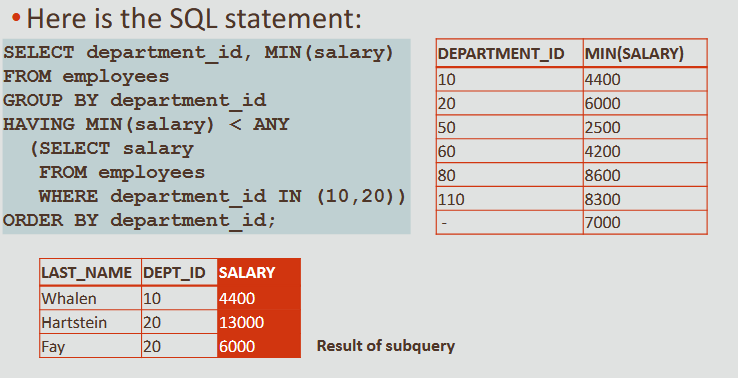

# 8. Using Subqueries to Solve Queries

 -  A subquery is a SELECT statement that is embedded in a clause of another SELECT statement
 -  A subquery executes once before the main query
 -  The result of the subquery is used by the main or outer query
 -  Subqueries can be placed in a number of SQL clauses, including the WHERE clause, the HAVING clause, and the FROM clause

#### Guidelines
 - The subquery is enclosed in parentheses
 - The subquery is placed on the right side of the comparison condition
 - The outer and inner queries can get data from different tables
 - Only one ORDER BY clause can be used for a SELECT statement; if used, it must be the last clause in the outer query
 - A subquery cannot have its own ORDER BY clause
 - The only limit on the number of subqueries is the buffer size the query uses
#### Two Types of Subqueries
 - Single-row subqueries that use single-row operators (>, =, >=, <, <>, <=) and return only one row from the inner query
 - Multiple-row subqueries that use multiple-row operators (IN, ANY, ALL) and return more than one row from the inner query

```sql
-- find out the names of the employees that were hired after Peter Vargas
SELECT first_name, last_name,
  hire_date
FROM employees
WHERE hire_date > (
  SELECT hire_date
  FROM employees
  WHERE last_name = 'Vargas'
);
```
#### Single Row Subquery
##### They:
 - Return only one row
 - Use single-row comparison operators (=, >,>=, <, <=, <>)
##### Always:
 - Enclose the subquery in parentheses
 - Place the subquery on the right hand side of the comparison condition
\
\
 -  The outer and inner queries can get data from different tables
 -  Only one ORDER BY clause can be used for a SELECT statement, and if specified, it must be the last clause in the main SELECT statement
 -  The only limit on the number of subqueries is the buffer size that the query uses
```sql
Single-Row Subquery:
SELECT last_name, job_id, department_id
FROM employees
WHERE department_id = (
  SELECT department_id
  FROM departments
  WHERE department_name = 'Marketing'
)
ORDER BY job_id;

-- More than one subquery can return information to the outer query
SELECT last_name, job_id, salary, department_id
FROM employees
WHERE job_id = (
  SELECT job_id
  FROM employees
  WHERE employee_id = 141
)
AND department_id = (
  SELECT department_id
  FROM departments
  WHERE location_id = 1500
);
```
### Group Functions in Subqueries
 -  Group functions can be used in subqueries
 -  A group function without a GROUP BY clause in the subquery returns a single row
```sql
-- The subquery first finds the average salary for all employees, the outer query then returns employees with a salary of less than the average
SELECT last_name, salary
FROM employees
WHERE salary < (
  SELECT AVG(salary)
  FROM employees
);

```
#### Subqueries in the HAVING Clause
 -  Subqueries can also be placed in the HAVING clause
 -  Remember that the HAVING clause is similar to the WHERE clause, except that the HAVING clause is used to restrict groups and always includes a group function such as MIN, MAX, or AVG
 -  Because the HAVING clause always includes a group function, the subquery will nearly always include a group function as well

```sql
-- Which departments have a lowest salary that is greater than the lowest salary in department 50?
SELECT department_id, MIN(salary)
FROM employees
GROUP BY department_id
HAVING MIN(salary) > (
  SELECT MIN(salary)
  FROM employees
  WHERE department_id = 50
);
```

### Multi-Row Subquery
 -  We achieve this using multiple-row subqueries and the three comparison operators: IN, ANY, and ALL

#### IN, ANY, and ALL
 -  Subqueries that return more than one value are called multiple-row subqueries
 - Because we cannot use the single-row comparison operators (=, <, and so on), we need different comparison operators for multiple-row subqueries
 - The multiple-row operators are:\
−IN,\
−ANY\
−ALL
 - The NOT operator can be used with any of these three operators

#### IN
 - The IN operator is used within the outer query WHERE clause to select only those rows which are IN the list of values returned from the inner query


```sql
-- we are interested in all the employees that were hired the same year as an employee in department 90
SELECT last_name, hire_date
FROM employees
WHERE EXTRACT(YEAR FROM hire_date) IN (
  SELECT EXTRACT(YEAR FROM hire_date)
  FROM employees
  WHERE department_id=90
);
```
#### ANY
 - The ANY operator is used when we want the outer-query WHERE clause to select the rows which match the criteria (<, >, =, etc.) of at least one value in the subquery result set
```sql
-- The example shown will return any employee whose year hired is less than at least one year hired of employees in department 90
SELECT last_name, hire_date
FROM employees
WHERE EXTRACT(YEAR FROM hire_date) < ANY (
  SELECT EXTRACT(YEAR FROM hire_date)
  FROM employees
  WHERE department_id=90
);
```
#### ALL
 -  The ALL operator is used when we want the outer-query WHERE clause to select the rows which match the criteria ( <, >, =, etc.) of all of the values in the subquery result set
 -  The ALL operator compares a value to every value returned by the inner query
```sql
SELECT last_name, hire_date FROM employees
WHERE EXTRACT(YEAR FROM hire_date) < ALL (
  SELECT EXTRACT(YEAR FROM hire_date)
  FROM employees
  WHERE department_id=90
);
```
#### NULL Values
 -  Suppose that one of the values returned by a multiple-row subquery is null, but other values are not
 -  If IN or ANY are used, the outer query will return rows which match the non-null values
 -  If ALL is used, the outer query returns no rows because ALL compares the outer query row with every value returned by the subquery, including the null
 -  And comparing anything with null results in null

#### GROUP BY and HAVING
 -  As you might suspect, the GROUP BY clause and the HAVING clause can also be used with multiple-row subqueries
 -  What if you wanted to find the departments whose minimum salary is less than the salary of any employee who works in department 10 or 20?
```sql
SELECT department_id, MIN(salary)
FROM employees
GROUP BY department_id
HAVING MIN(salary) < ANY (
  SELECT salary
  FROM employees
  WHERE department_id IN (10,20)
)
ORDER BY department_id;
```


#### Multiple-Column Subqueries
 -  Subqueries can use one or more columns
 -  If they use more than one column, they are called multiple-column subqueries
 -  A multiple-column subquery can be either pair-wise comparisons or non-pair-wise comparisons
```sql
SELECT employee_id, manager_id, department_id
FROM employees
WHERE(manager_id,department_id) IN (
  SELECT manager_id,department_id
  FROM employees
  WHERE employee_id IN (149,174)
)
AND employee_id NOT IN (149,174)
```


 - A non-pair-wise multiple-column subquery also uses more than one column in the subquery, but it compares them one at a time, so the comparisons take place in different subqueries
 - You will need to write one subquery per column you want to compare against when performing
non-pair-wise multiple column subqueries
```sql
-- NON-PAIR-WISE multi-column subquery
SELECT employee_id, manager_id, department_id
FROM employees
WHERE manager_id IN (
  SELECT manager_id
  FROM employees
  WHERE employee_id IN(149,174)
)
AND department_id IN (
  SELECT department_id
  FROM employees
  WHERE employee_id IN
  (149,174)
)
AND employee_id NOT IN(149,174);
```

### Correlated Subqueries
#### Purpose
 -  Sometimes you have to answer more than one question in one sentence
 -  Your friend might ask you if you have enough money for a cinema ticket, popcorn, and a drink
---
 - The Oracle server performs a correlated subquery when the subquery references a column from a table referred to in the parent statement
 - A correlated subquery is evaluated once for each row processed by the parent statement
 - The parent statement can be a SELECT, UPDATE, or DELETE statement


```sql
-- Whose salary is higher than the average salary of their department?
SELECT o.first_name,o.last_name,
o.salary
FROM employees o
WHERE o.salary > (
  SELECT AVG(i.salary)
  FROM employees i
  WHERE i.department_id = o.department_id
);
```
 -  Each subquery is executed once for every row of the outer query
 -  With a normal subquery, the inner SELECT query runs first and executes once, returning values to be used by the outer query
```sql
SELECT o.first_name,
o.last_name, o.salary
FROM employees o
WHERE o.salary > (
  SELECT AVG(i.salary)
  FROM employees i
  WHERE i.department_id = o.department_id
);
```

#### EXISTS & NOT EXISTS in Subqueries
 -  EXISTS, and its opposite NOT EXISTS, are two clauses that can be used when testing for matches in subqueries
 -  EXISTS tests for a TRUE, or a matching result in the subquery

```sql
--  In this example, the subquery is selecting the employees that are managers
--  The outer query then returns the rows from the employee table that do NOT EXIST in the subquery
SELECT last_name AS "Not a Manager"
FROM employees emp
WHERE NOT EXISTS (
  SELECT *
  FROM employees mgr
  WHERE mgr.manager_id = emp.employee_id
);
```

#### WITH Clause
 - If you have to write a very complex query with joins and aggregations used many times, you can write the different parts of the statement as query blocks and then use those same query blocks in a SELECT statement
 - Oracle allows you to write named subqueries in one single statement, as long as you start your statement with the keyword WITH
 - The WITH clause retrieves the results of one or more query blocks and stores those results for the user who runs the query
---
 -  The WITH clause improves performance
 -  The WITH clause makes the query easier to read
 -  The syntax for the WITH clause is as follows:

---
 - Display a list of employee last names that are not managers
 -  To construct this query, you will first need to get a list of manager_ids from the employee table, then return the names of the employees whose employee id is not on the managers list
 -  We can create a named subquery using the WITH clause to retrieve the manager_id from the employees table, then the outer query will return the employees that do not appear on that list

